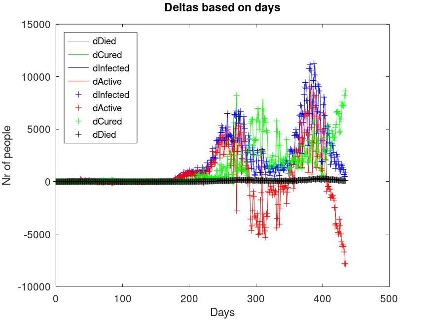
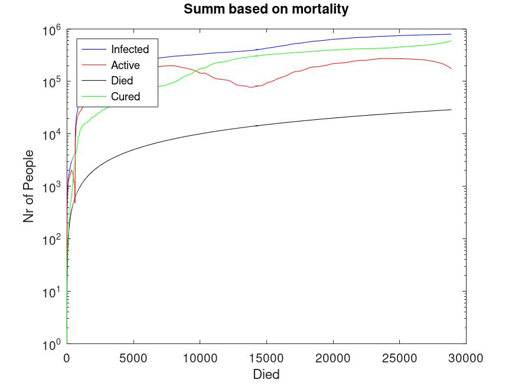
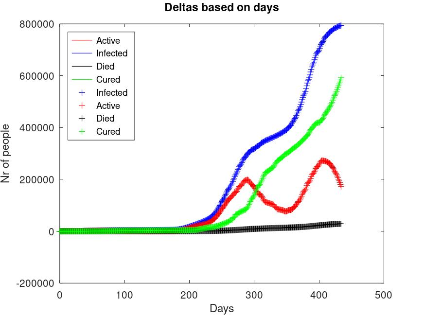
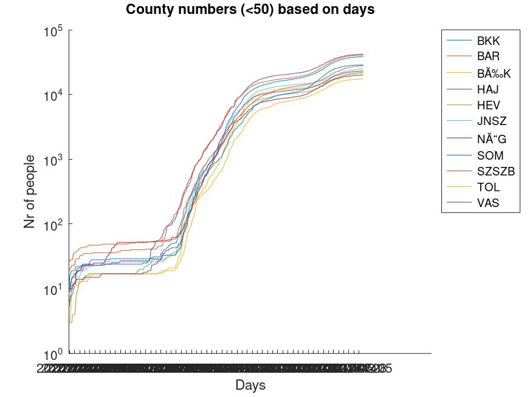
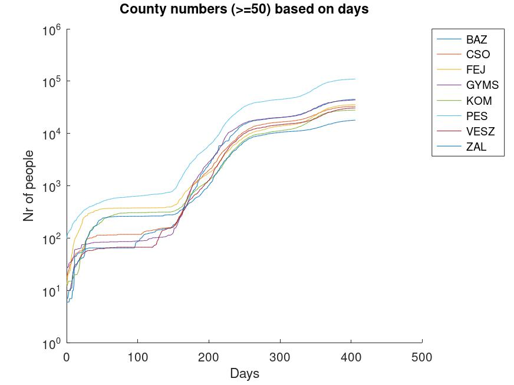
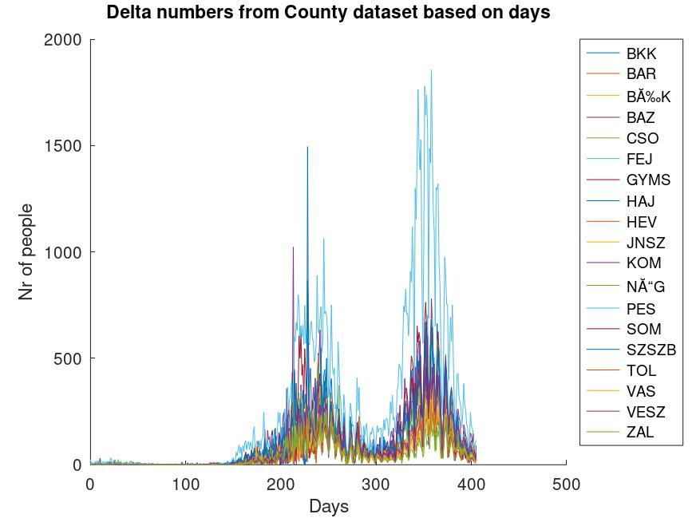
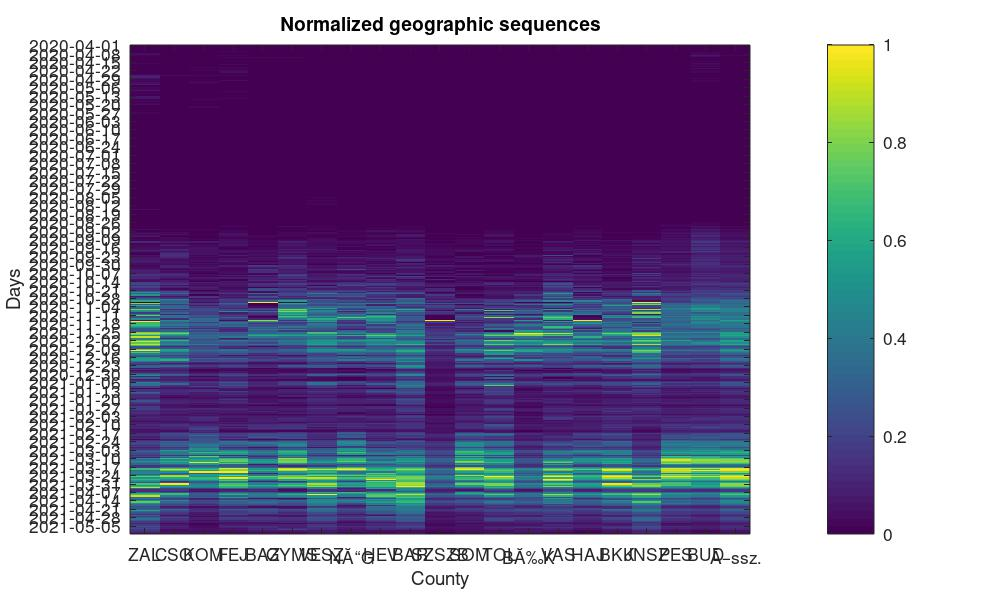
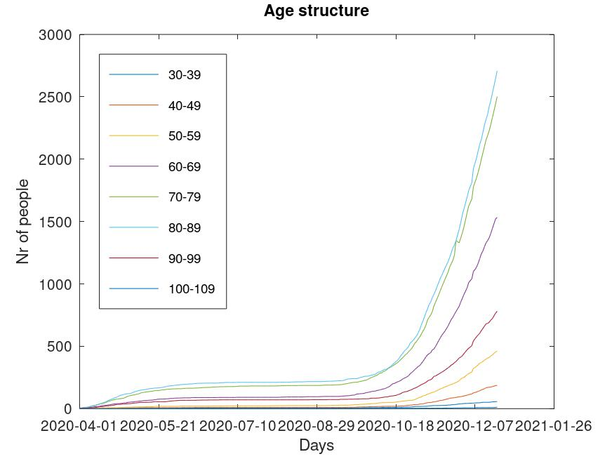
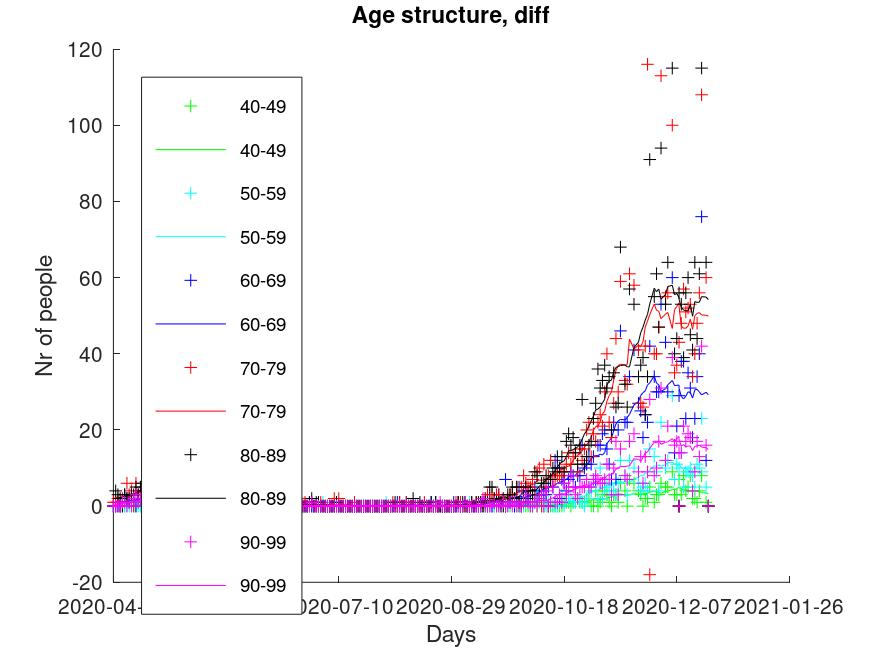

# hu_covid_datas
Matlab / Octave example project using Hungarian Covid19 raw datas

The aim of this project to help on you learing the Matlab script language quickly.

Input data come from this [wikipedia link](https://hu.wikipedia.org/wiki/2020-as_COVID%E2%80%9319-koronav%C3%ADrus-j%C3%A1rv%C3%A1ny_Magyarorsz%C3%A1gon),
updated on 2021-02-03.  
Day zero in curves is 2020-03-04 when the first 2 people tested positive to Covid19 in Budapest.  
Other curves:
[Trajectory](https://aatishb.com/covidtrends/?location=Australia&location=Brazil&location=Canada&location=China&location=France&location=Germany&location=Hong+Kong&location=Hungary&location=India&location=Italy&location=Japan&location=Russia&location=Singapore&location=South+Korea&location=Spain&location=Taiwan&location=Turkey&location=US&location=United+Kingdom) |
[Waze stats](http://wazestats.com/active.php?city=7) |
[Johns Hopkins University](https://www.arcgis.com/apps/opsdashboard/index.html#/bda7594740fd40299423467b48e9ecf6) |
[Reproduction numbers](https://stochastik-tu-ilmenau.github.io/COVID-19/) |
[CoronaHu](https://coronahu.site/) |
[WorldoMeters](https://www.worldometers.info/coronavirus/country/hungary/) |
[Pandemia.hu](http://pandemia.hu/koronavirus-magyarorszag/)

  

<B>Figure 1:</B> 
Delta values are oversampled 24 times to get hourly resolution, interpolated, then filtered to calculate the mean curve.
 

 
<B>Figure 2:</B> 
The curves are linear interpolated only.
 

 
<B>Figure 3:</B> 

 
Day zero on figure 4-7 is 2020-04-01 when the county statistics started to shown on government publications.  
<B>Figure 4:</B> 
Absolute numbers where max is less than 50. 

 
<B>Figure 5:</B> 
Absolute numbers where max is greater than 50. 

 
<B>Figure 6:</B> 
Delta numbers where daily change max is greater than 10.
 

 
<B>Figure 7:</B> 
The normalized deltas on all the counties.
 

 
<B>Figure 8:</B> 
Age structure.
 

 
<B>Figure 9:</B> 
Age structure.
 

 

